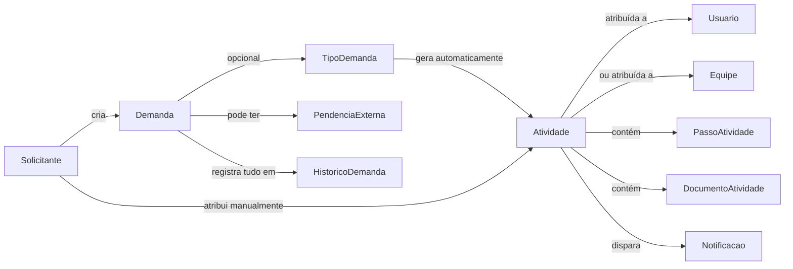

# Arquitetura do Novo Fluxo de Demandas

## Visão geral

## Camadas

- **Frontend**: Next.js 14 (App Router). Páginas em `frontend/src/app/(dashboard)/demandas`, `/equipes`, `/tipos-demanda`. Sidebar com sino de notificações.
- **Backend**: Express + Prisma. Rotas em `backend/src/routes/{demandas,equipes,tiposDemanda,notificacoes}.routes.ts`.
- **Domínio puro e testável**: `backend/src/domain/estados.ts` — as máquinas de estado não dependem de Express nem de Prisma, por isso são testadas isoladamente (`estados.test.ts`).
- **Autorização**: aplicada no backend, nunca apenas escondendo botões no frontend (ver `MATRIZ_DE_PERMISSOES.md`).

## Por que Demanda ≠ Atividade

Uma **Demanda** é o processo administrativo (ex.: GEP 126158/2025 — revalidação de alvará da Vila Elisa). Uma **Atividade** é uma providência específica dentro dela (ex.: "emitir RRT", "colher assinatura"), atribuída a um usuário ou equipe, com checklist e documentos próprios. Uma demanda pode ter várias atividades sucessivas, e a mesma equipe pode reaparecer em atividades diferentes da mesma demanda (ex.: engenharia corrige uma planta duas vezes).

## Motor de fluxo (simplificado)

Diferente de um motor de workflow genérico com condições/paralelismo/desvios configuráveis (fora do escopo desta entrega), o motor implementado é um **gerador de atividades padrão**: um `TipoDemanda` tem uma lista ordenada de `ModeloEtapa` (título, instruções, equipe padrão, prazo em dias). Ao criar uma demanda escolhendo esse tipo, todas as atividades do modelo são criadas de uma vez, sem responsável/equipe obrigatório em cada uma se a etapa não definir. Não há hoje: execução condicional, paralelismo real, nem "esperar a etapa anterior terminar antes de liberar a próxima" — todas nascem juntas. Isso é suficiente para o caso de uso do documento de referência, mas é uma simplificação relevante que deve ser avaliada antes de expandir para processos mais complexos.

## Equipes

Uma `Atividade` é atribuída a um `User` **ou** a uma `Equipe` (nunca ambos). Quando atribuída a uma equipe, qualquer membro pode iniciar/concluir a atividade e gerenciar seu checklist — não há hoje um conceito de "responsável principal dentro da equipe assumir a tarefa exclusivamente" (o campo `EquipeMembro.principal` existe no schema mas ainda não altera o comportamento de autorização).

## Documentos

Seguindo o padrão já usado em todo o sistema (Imóveis → Documentos), os documentos de atividade são **links do Google Drive**, não upload de arquivo. O campo `versao` incrementa quando um documento com o mesmo nome é anexado novamente na mesma atividade — não há diff nem hash de integridade.

## Notificações

Central in-app (`Notificacao`), sem envio de e-mail real (conforme instrução explícita do escopo original: "durante o desenvolvimento, não envie e-mails reais"). Eventos que geram notificação: atividade atribuída, concluída, devolvida, aprovada.
