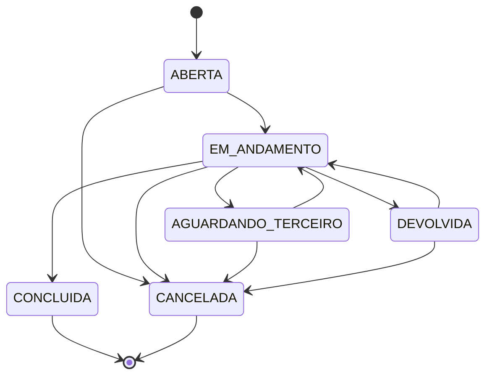
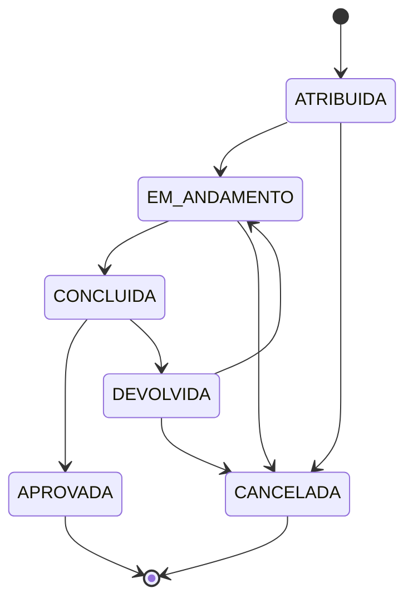

# Estados e Transições

Fonte da verdade: `backend/src/domain/estados.ts` (módulo puro, testado em `estados.test.ts`). As rotas nunca fazem `demanda.status = X` diretamente — sempre passam pela função `transicaoValida()`.

## Demanda

`ABERTA` sai automaticamente para `EM_ANDAMENTO` assim que a primeira atividade é criada (na criação manual ou pelo motor de fluxo de um `TipoDemanda`). Ao registrar uma `PendenciaExterna`, a demanda em `EM_ANDAMENTO` passa automaticamente para `AGUARDANDO_TERCEIRO`.

**Conclusão automática pelo motor de fluxo** (adicionado após a Fase 2): quando a demanda usa um `TipoDemanda` e a **última** etapa do modelo é aprovada, a demanda vai para `CONCLUIDA` automaticamente — sem exigir uma ação manual do solicitante. Ver seção "Motor de fluxo sequencial" abaixo.

## Atividade

### Regras adicionais na transição (validadas no backend, não só na máquina de estados)

- **Concluir com passo pendente**: exige campo `motivo` (justificativa) no corpo da requisição, senão é rejeitado com o número de passos pendentes.
- **Devolver**: exige `motivo` sempre, senão é rejeitado.
- **Quem pode**: ver `MATRIZ_DE_PERMISSOES.md` — a validação de estado (`transicaoValida`) e a validação de autorização (quem está logado) são checagens independentes, ambas precisam passar.

## Motor de fluxo sequencial (adicionado após a Fase 2)

Quando uma `Atividade` tem `modeloEtapaId` (foi gerada por um `TipoDemanda`), aprová-la dispara `ativarProximaEtapaDoFluxo()`:

1. Só a **primeira** etapa do modelo é criada ao abrir a demanda — as demais não existem ainda.
2. Ao aprovar uma etapa, busca a próxima `ModeloEtapa` (`ordem + 1`) do mesmo `TipoDemanda`.
3. Se existir e ainda não tiver sido criada para esta demanda específica, cria a atividade automaticamente (idempotente — nunca duplica a mesma etapa).
4. Se não houver próxima etapa, conclui a demanda automaticamente (ver acima).

Atividades criadas manualmente (sem `modeloEtapaId`) não disparam esse efeito — o motor de fluxo só rege atividades que ele mesmo gerou.

**Limitação conhecida**: a dependência é estritamente sequencial (uma etapa por vez). Não há paralelismo (duas etapas simultâneas), condições (pular uma etapa conforme uma regra) nem desvios configuráveis — isso continua fora do escopo desta entrega.

## Escalonamento de prazo (adicionado após a Fase 2)

Sem infraestrutura de cron no projeto, roda de forma "preguiçosa" nas rotas `GET /api/demandas` e `GET /api/demandas/painel/resumo`, já consultadas a cada 60s pelo frontend. Quando uma demanda tem `prazo` vencido, `status` ainda ativo (não `CONCLUIDA`/`CANCELADA`) e `escalonado = false`:
- Notifica o solicitante e todos os usuários MASTER (`PRAZO_VENCIDO`).
- Marca `escalonado = true` — nunca notifica duas vezes pelo mesmo vencimento.
- Editar o `prazo` da demanda reseta `escalonado` para `false` (permite novo alerta se vencer de novo).

## Testes automatizados desta máquina

`backend/src/domain/estados.test.ts` cobre, entre outros: transição válida simples, bloqueio de "pular etapa" (ex.: `ATRIBUIDA` direto para `CONCLUIDA`), bloqueio de qualquer saída de estado final (`CONCLUIDA`/`CANCELADA`/`APROVADA`), o ciclo completo de devolução e correção, e a garantia de que nenhuma ação pertence simultaneamente ao conjunto "ações do responsável" e "ações do solicitante" (evitaria ambiguidade de autorização).
