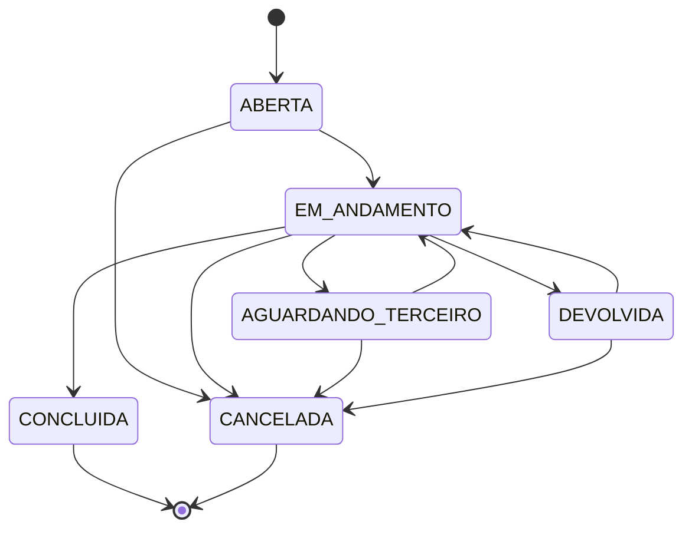
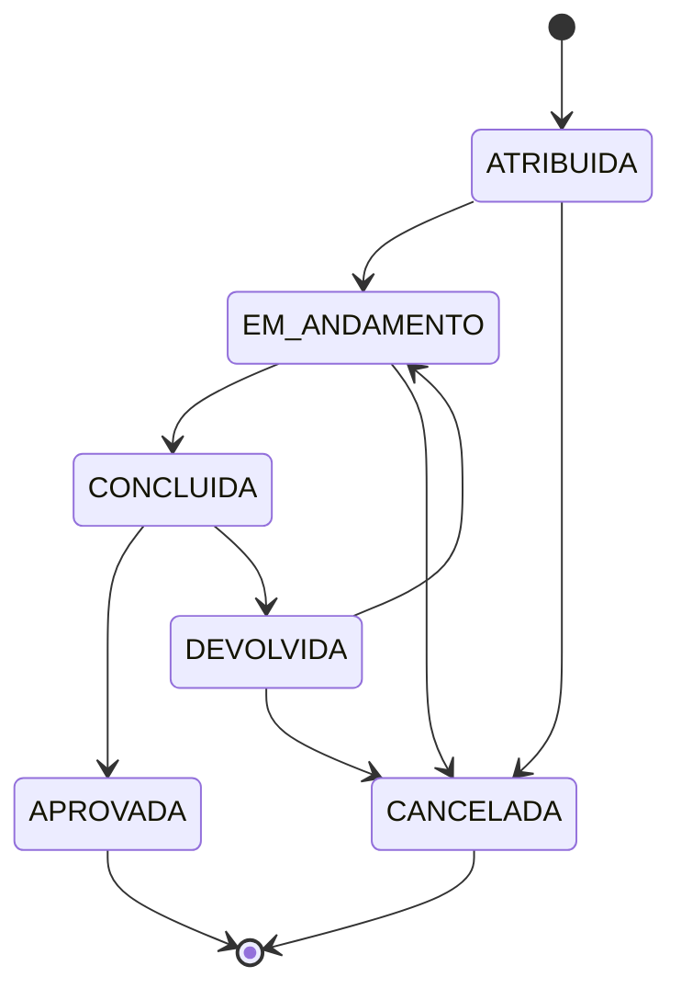

# Estados e Transições

Fonte da verdade: `backend/src/domain/estados.ts` (módulo puro, testado em `estados.test.ts`). As rotas nunca fazem `demanda.status = X` diretamente — sempre passam pela função `transicaoValida()`.

## Demanda

`ABERTA` sai automaticamente para `EM_ANDAMENTO` assim que a primeira atividade é criada (na criação manual ou pelo motor de fluxo de um `TipoDemanda`). Ao registrar uma `PendenciaExterna`, a demanda em `EM_ANDAMENTO` passa automaticamente para `AGUARDANDO_TERCEIRO`.

## Atividade

### Regras adicionais na transição (validadas no backend, não só na máquina de estados)

- **Concluir com passo pendente**: exige campo `motivo` (justificativa) no corpo da requisição, senão é rejeitado com o número de passos pendentes.
- **Devolver**: exige `motivo` sempre, senão é rejeitado.
- **Quem pode**: ver `MATRIZ_DE_PERMISSOES.md` — a validação de estado (`transicaoValida`) e a validação de autorização (quem está logado) são checagens independentes, ambas precisam passar.

## Testes automatizados desta máquina

`backend/src/domain/estados.test.ts` cobre, entre outros: transição válida simples, bloqueio de "pular etapa" (ex.: `ATRIBUIDA` direto para `CONCLUIDA`), bloqueio de qualquer saída de estado final (`CONCLUIDA`/`CANCELADA`/`APROVADA`), o ciclo completo de devolução e correção, e a garantia de que nenhuma ação pertence simultaneamente ao conjunto "ações do responsável" e "ações do solicitante" (evitaria ambiguidade de autorização).
