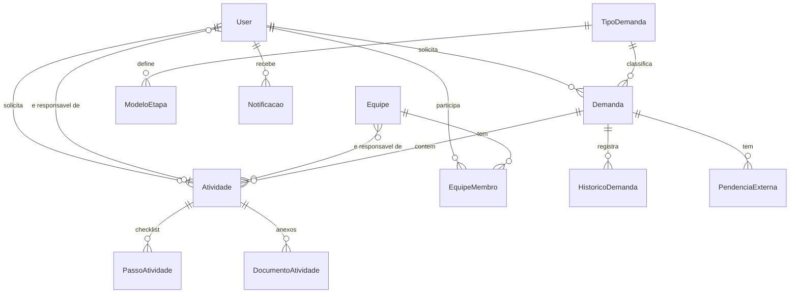

# Modelo de Dados — Módulo de Demandas

Todas as tabelas abaixo são **aditivas**: nenhuma tabela pré-existente (Imovel, Ocorrencia, Tarefa, User, Log...) foi alterada ou removida.

## Tabelas

### `demandas`
| Campo | Tipo | Observação |
|---|---|---|
| gepNumero, gepAno | String | Obrigatórios para novas demandas. **Não são chave primária** (id é uuid) — GEP é dado de negócio, permite duplicidade justificada com aviso |
| tipoDemandaId | String? | Opcional; se definido, gera atividades automáticas na criação |
| status | enum StatusDemanda | Ver `ESTADOS_E_TRANSICOES.md` |
| solicitanteId | String | Quem criou — usado na autorização (editar, mudar status, atribuir atividades) |

### `atividades`
| Campo | Tipo | Observação |
|---|---|---|
| responsavelId | String? | Nullable — mutuamente exclusivo com `equipeId` |
| equipeId | String? | Nullable — quando definido, qualquer membro pode agir como responsável |
| solicitanteId | String | Quem criou a atividade (autoriza aprovar/devolver) |
| status | enum StatusAtividade | Ver `ESTADOS_E_TRANSICOES.md` |
| motivoDevolucao | String? | Preenchido só ao devolver |

### `passos_atividade`, `documentos_atividade`
Checklist e anexos (link + versão incremental) por atividade. Cascade delete ao excluir a atividade.

### `equipes`, `equipe_membros`
`equipe_membros` tem `@@unique([equipeId, userId])` — não permite membro duplicado. `principal` existe mas ainda não é usado por regra de autorização (ver ressalva em `ARQUITETURA_NOVO_FLUXO.md`).

### `tipos_demanda`, `modelo_etapas`
Motor de fluxo simplificado. `modelo_etapas.equipeId` é uma referência solta (sem FK formal ao model `Equipe` no Prisma) — validado apenas na hora de gerar a atividade automática.

### `pendencias_externas`
Registra dependência de terceiro (órgão/pessoa) por demanda. Campo `status` é string livre (`AGUARDANDO`, `RESPONDIDA`, `COBRADA`, ...) — não é enum, para permitir extensão sem migration.

### `historico_demandas`
Timeline imutável (append-only) por demanda. Não há endpoint de edição ou exclusão — é a "linha do tempo legível" pedida na Etapa 18. O log técnico de auditoria mais granular continua sendo a tabela `logs` já existente no sistema.

### `notificacoes`
Uma linha por usuário por evento (não há agrupamento). `lida: Boolean` — sem soft delete, sem expiração automática.

## O que intencionalmente não foi criado nesta entrega

`Permissao` (tabela dinâmica de permissões), `InstanciaFluxo` (execução de workflow com estado próprio), `VersaoDocumento` com hash/diff real, `Mencao` (menções em comentários — não há comentários implementados), `Etiqueta`. Ver `DIAGNOSTICO_FLUXO_ATUAL.md` para o racional da priorização.
